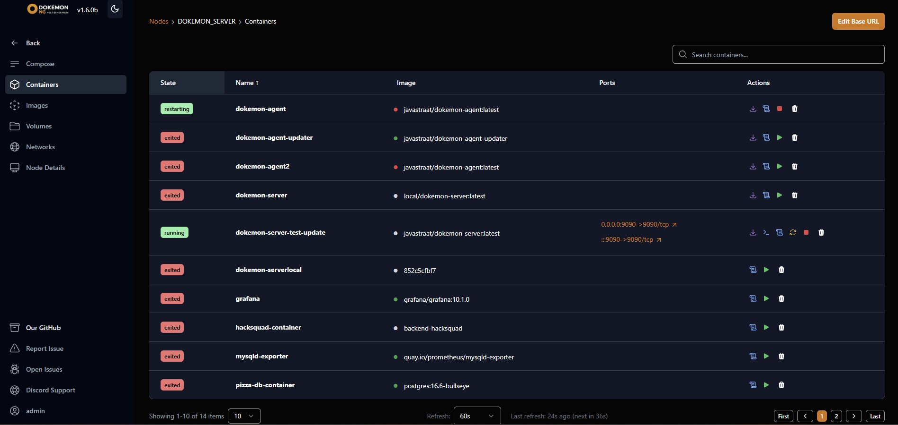

# Dokémon (Dokemon) Server & Agent Manual

## Table of Contents
1. [Overview](#overview)
2. [Features](#features)
3. [Screenshots](#screenshots)
4. [Quickstart](#quickstart)
5. [Step-by-Step Video Guide](#step-by-step-video-guide)
6. [Functional Manual](#functional-manual)
7. [API Reference](#api-reference)
8. [Security Best Practices](#security-best-practices)
9. [Troubleshooting](#troubleshooting)
10. [License](#license)

---

## Overview
Dokémon is a modern, user-friendly platform for monitoring and managing Docker containers across multiple servers. It consists of a **Server** (with a web UI) and optional **Agents** for remote node management.

---

## Features
- Manage containers, images, volumes, and networks via a web UI
- Deploy and control Docker Compose projects
- Multi-server support (manage many Docker hosts from one UI)
- Secure authentication and role-based access
- Integration with GitHub for Compose files
- Real-time logs and terminal access
- Works on Linux, macOS, and Windows

---

## Screenshots

### Dashboard: Manage Multiple Servers


### Environment Variables


### Deploy Compose Projects


### Containers Overview


---

## Quickstart

### 1. Running the Dokémon Server

#### With Docker
```sh
sudo mkdir /dokemondata
sudo docker run -p 9090:9090 -p 9443:9443 \
  --net=host \
  -v /dokemondata:/data \
  -v /var/run/docker.sock:/var/run/docker.sock \
  --restart unless-stopped \
  --name dokemon-server -d javastraat/dokemon-server:latest
```
- Access the web UI at: `http://localhost:9090` (or `https://localhost:9443` if SSL is enabled)
- On first launch, create an admin user

#### With Docker Compose (Recommended for Production)
See the provided `compose/compose.yaml` for a full example, including Traefik reverse proxy and SSL.

### 2. Adding Remote Nodes (Agents)
If you want to manage remote Docker hosts:
- Deploy the Dokémon Agent on the remote host.
- Register the agent with the server using a registration token.

#### Example: Running the Agent
```sh
sudo docker run --net=host \
  -v /var/run/docker.sock:/var/run/docker.sock \
  --name dokemon-agent -d javastraat/dokemon-agent:latest \
  --server-url https://YOUR_DOKEMON_SERVER:9443 \
  --token YOUR_REGISTRATION_TOKEN
```
- Replace `YOUR_DOKEMON_SERVER` and `YOUR_REGISTRATION_TOKEN` with values from the server UI.

---

## Step-by-Step Video Guide

[](https://www.youtube.com/watch?v=2QZ7p-5V7bA)

*If you have your own video, upload it to YouTube and replace the link above.*

---

## Functional Manual

### Logging In
1. Open the Dokémon web UI in your browser.
2. Enter your username and password.
3. If you are the first user, you will be prompted to create an admin account.

### Adding a Node
1. Go to the **Nodes** section.
2. Click **Add Node**.
3. Follow the instructions to generate a registration token.
4. Deploy the agent on the remote host using the token.

### Managing Containers
- **List Containers:** View all running and stopped containers on any node.
- **Start/Stop/Restart/Remove:** Use the action buttons next to each container.
- **Logs:** Click the logs icon to view real-time logs.
- **Terminal:** Open a shell directly into the container.

### Images, Volumes, Networks
- Use the respective tabs to list, remove, or prune Docker images, volumes, and networks.

### Compose Projects
- **Add from GitHub:** Import a Compose file directly from a public or private GitHub repo.
- **Add Local:** Paste or upload a Compose YAML file.
- **Deploy/Up/Down:** Use the UI to deploy, start, or stop Compose projects.

### Environment Variables
- Define and manage environment variables for different projects and environments.

### Credentials
- Store GitHub tokens for accessing private repositories.

---

## API Reference

Dokémon provides a REST API for automation and integration. See the included `dokemon-api.yaml` for full API documentation. Here are some 

### Authentication
- `POST /api/v1/users` – Create user
- `POST /api/v1/users/login` – Login (sets auth cookie)
  ```example :
  curl -c dokemon-cookie.txt -X POST http://<host>:<port>/api/v1/users/login \
  -H "Content-Type: application/json" \
  -d '{"userName": "admin", "password": "1234567890"}'
  ```
  
- `POST /api/v1/users/logout` – Logout (clears auth cookie)
- `POST /api/v1/changepassword` – Change password

### Nodes (Docker Hosts)
- `GET /api/v1/nodes` – List nodes
  ```example :
  curl -b dokemon-cookie.txt "http://<host>:<port>/api/v1/nodes?p=1&s=10"
  ```
- `POST /api/v1/nodes` – Create node
- `PUT /api/v1/nodes/:id` – Update node
- `PATCH /api/v1/nodes/:id` – Update node container base URL
- `GET /api/v1/nodes/:id` – Get node details
  ```example :
  curl -b dokemon-cookie.txt http://<host>:<port>/api/v1/nodes/<nodeId>
  ```
- `DELETE /api/v1/nodes/:id` – Delete node
- `POST /api/v1/nodes/:id/generatetoken` – Generate agent registration token

### Containers
- `GET /api/v1/nodes/:nodeId/containers` – List containers
  ``` example:
  curl -b dokemon-cookie.txt http://<host>:<port>/api/v1/nodes/<nodeId>/containers
  ```
- `POST /api/v1/nodes/:nodeId/containers/start` – Start container
  ``` # Start container
  curl -X POST http://<host>:<port>/api/v1/nodes/<nodeId>/containers/start \
  -H "Content-Type: application/json" \
   -b dokemon-cookie.txt \
  -d '{"id":"<containerId>"}'
  ```
- `POST /api/v1/nodes/:nodeId/containers/stop` – Stop container
  ``` # Stop container
  curl -X POST http://<host>:<port>/api/v1/nodes/<nodeId>/containers/stop \
  -H "Content-Type: application/json" \
   -b dokemon-cookie.txt \
  -d '{"id":"<containerId>"}'
  ```
- `POST /api/v1/nodes/:nodeId/containers/restart` – Restart container
  ``` # Restart container
  curl -X POST http://<host>:<port>/api/v1/nodes/<nodeId>/containers/restart \
  -H "Content-Type: application/json" \
   -b dokemon-cookie.txt \
  -d '{"id":"<containerId>"}'
  ```
- `POST /api/v1/nodes/:nodeId/containers/remove` – Remove container
  ``` # Remove (delete) container
  curl -X POST http://<host>:<port>/api/v1/nodes/<nodeId>/containers/remove \
  -H "Content-Type: application/json" \
  -b dokemon-cookie.txt \
  -d '{"id":"<containerId>","force":true}'
  ```
- `GET /api/v1/nodes/:nodeId/containers/:id/logs` – View container logs
  ``` example
  wscat -c ws://<host>:<port>/api/v1/nodes/<nodeId>/containers/<containerId>/logs \
  --header "Cookie: <YOUR_SESSION_COOKIE>"
  ```
- `GET /api/v1/nodes/:nodeId/containers/:id/terminal` – Open container terminal (WebSocket)
  ``` example
  wscat -c "ws://<server_ip>:<server_port>/api/v1/nodes/<nodeId>/containers/<containerId>/terminal" --header "Cookie: <YOUR_SESSION_COOKIE>"
  ```

### Images
- `GET /api/v1/nodes/:nodeId/images` – List images
  ``` example
  curl  -b dokemon-cookie.txt http://<host>:<port>/api/v1/nodes/<nodeId>/images
  ```
- `POST /api/v1/nodes/:nodeId/images/remove` – Remove image
  ``` example
  curl  -b dokemon-cookie.txt \
  -H "Content-Type: application/json" \
  -X POST \
  -d '{"id":"sha256:YOUR_IMAGE_ID","force":false}' \
  http://<host>:<port>/api/v1/nodes/<nodeId>/images/remove
  ```
- `POST /api/v1/nodes/:nodeId/images/prune` – Prune images
  ``` example
  curl  -b dokemon-cookie.txt  \
  -H "Content-Type: application/json" \
  -X POST \
  -d '{"all":true}' \
  http://<host>:<port>/api/v1/nodes/<nodeId>/images/prune

### Volumes
- `GET /api/v1/nodes/:nodeId/volumes` – List volumes
  ```
  curl -b dokemon-cookie.txt http://<host>:<port>/api/v1/nodes/<nodeId>/volumes
  ```
- `POST /api/v1/nodes/:nodeId/volumes/create` – Create volume
  ``` example
  curl -b dokemon-cookie.txt \
  -H "Content-Type: application/json" \
  -X POST \
  -d '{"name":"myvolume","driver":"local"}' \
  http://<host>:<port>/api/v1/nodes/<nodeId>/volumes/create
  ```
  * Note works only on Server not remote (yet)
- `POST /api/v1/nodes/:nodeId/volumes/remove` – Remove volume
  ```
  curl -b dokemon-cookie.txt \
  -H "Content-Type: application/json" \
  -X POST \
  -d '{"name":"myvolume"}' \
  http://<host>:<port>/api/v1/nodes/<nodeId>/volumes/remove
  ```
- `POST /api/v1/nodes/:nodeId/volumes/prune` – Prune volumes
  ```
  curl -b dokemon-cookie.txt \
  -H "Content-Type: application/json" \
  -X POST \
  -d '{"all":true}' \
  http://<host>:<port>/api/v1/nodes/<nodeId>/volumes/prune
  ```

### Networks
- `GET /api/v1/nodes/:nodeId/networks` – List networks
- `POST /api/v1/nodes/:nodeId/networks/create` – Create network
- `POST /api/v1/nodes/:nodeId/networks/remove` – Remove network
- `POST /api/v1/nodes/:nodeId/networks/prune` – Prune networks

### Compose Projects
- `GET /api/v1/nodes/:nodeId/compose` – List Compose projects
- `POST /api/v1/nodes/:nodeId/compose/create/github` – Create Compose project from GitHub
- `POST /api/v1/nodes/:nodeId/compose/create/local` – Create Compose project from local definition
- `GET /api/v1/nodes/:nodeId/compose/:id` – Get Compose project details
- `PUT /api/v1/nodes/:nodeId/compose/:id/github` – Update GitHub Compose project
- `PUT /api/v1/nodes/:nodeId/compose/:id/local` – Update local Compose project
- `DELETE /api/v1/nodes/:nodeId/compose/:id` – Delete Compose project
- `GET /api/v1/nodes/:nodeId/compose/:id/containers` – List containers in Compose project
- `GET /api/v1/nodes/:nodeId/compose/:id/logs` – Get Compose project logs
- `GET /api/v1/nodes/:nodeId/compose/:id/deploy` – Deploy Compose project
- `GET /api/v1/nodes/:nodeId/compose/:id/pull` – Pull Compose project images
- `GET /api/v1/nodes/:nodeId/compose/:id/up` – Compose up
- `GET /api/v1/nodes/:nodeId/compose/:id/down` – Compose down

### Environments
- `GET /api/v1/environments` – List environments
- `POST /api/v1/environments` – Create environment
- `PUT /api/v1/environments/:id` – Update environment
- `DELETE /api/v1/environments/:id` – Delete environment

### Variables
- `GET /api/v1/variables` – List variables
- `POST /api/v1/variables` – Create variable
- `PUT /api/v1/variables/:id` – Update variable
- `DELETE /api/v1/variables/:id` – Delete variable

### WebSocket
- `GET /ws` – WebSocket endpoint for agent/browser communication

### Health Check
- `GET /healthz` – Returns "OK" if the server is running

---

## Security Best Practices
- Always run Dokémon behind a reverse proxy with SSL in production.
- Use strong passwords for all users.
- Regularly update Dokémon to the latest version.

---

## Troubleshooting
- **Cannot connect to Docker:** Ensure the Docker socket is mounted and permissions are correct.
- **Agent not connecting:** Check server URL, token, and network connectivity.
- **UI not loading:** Check container logs for errors.

---

## License
Dokémon is MIT licensed.

For more help, visit the [GitHub repository](https://github.com/dokemon-ng/dokemon) or open an issue.
